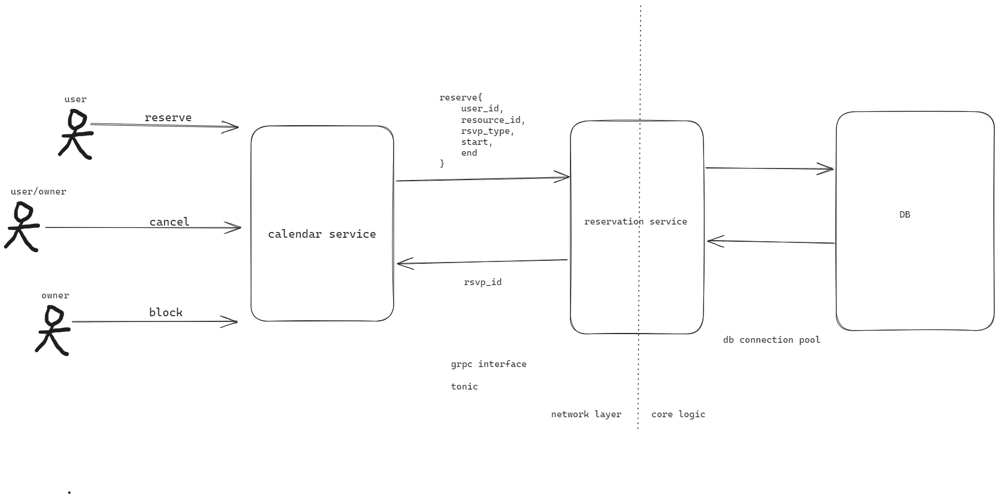
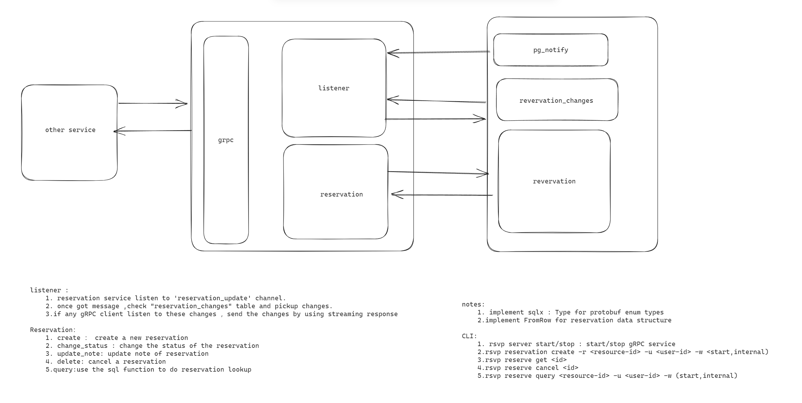

# Core Reservation Service

- Feature Name: core-reservation-service
- Start Date:  2023年8月27日15:57:49

## Summary

一个预定服务系统的核心功能，解决不同用户的预定需求。利用postgres的exclude 约束来解决在某一段时间内，某一资源只能被一个用户预定的问题。

## Motivation
我们需要一个通用的解决方案来满足各种预定需求，比如：
1. 日历预定
2. 酒店/房间预定
3. 会议室预定
4. 停车场预定
5. 等等

针对这些需求重复构建功能是浪费时间和资源。应该有一个可以供所有团队使用的解决方案


## Guide-level explanation

基本结构


### service intercace
```proto

enum ReservationStatus {
    UNKNOWN = 0;
    PENDING = 1;
    CONFIRMED = 2;
    CANCELED = 3;
}
enum ReservationUpdateType {
    UNKNOWN = 0;
    CREATE = 1;
    UPDATE = 2;
    CANCEL = 3;
}
message Reservation {
    string id = 1;
    string user_id = 2;

    string resource_id = 3;
    int64 start_time = 4;
    int64 end_time = 5;

    int64 create_time = 6;
    int64 update_time = 7;
    int64 cancel_time = 8;
    ReservationStatus status = 9;
    // 备注信息
    string note = 10;
}
message ReservationRequest {
    Reservation reservation = 1;
}
message ReservationResponse {
    Reservation reservation = 1;
}
message UpdateRequest {
    string note = 1;
}
message UpdateResponse {
    Reservation reservation = 1;
}
message ConfirmRequest {
   string id = 1;
}
message ConfirmResponse {
   Reservation reservation = 1;
}
message CancelRequest {
   string id = 1;
}
message CancelResponse {
   Reservation reservation = 1;
}
message GetRequest {
   string id = 1;
}
message GetResponse {
   Reservation reservation = 1;
}
message QueryRequest {
    string user_id = 1;
    string resource_id = 2;
    int64 start_time = 3;
    int64 end_time = 4;
    // 使用status 去过滤 如果是UNKNOWN 则不过滤
    ReservationStatus status = 5;
}
message ListRequest {}
message ListResponse {
    int8 op = 1;
    Reservation reservations = 2;
}
service ReservationService {
    rpc reserve(ReservationRequest) returns (ReservationResponse) {}
    rpc update(UpdateRequest) returns (UpdateResponse) {}
    rpc Confirm(ConfirmRequest) returns (ConfirmResponse) {}
    rpc cancel(CancelRequest) returns (CancelResponse) {}
    rpc get(GetRequest) returns (GetResponse) {}
    rpc query(QueryRequest) returns (ListResponse) {}
    rpc listen(ListRequest) returns (stream Reservation ) {}
}
```

### Database schema
```sql
create schema rsvp;
CREATE TYPE rsvp.reservation_status AS ENUM (
    'UNKNOWN',
    'PENDING',
    'CONFIRMED',
    'CANCELED'
);
CREATE TYPE rsvp.reservation_update_type AS ENUM (
    'UNKNOWN',
    'CREATE',
    'UPDATE',
    'DELETE'
);
CREATE TABLE rsvp.reservations (
    id uuid NOT NULL DEFAULT uuid_generate_v4(),
    user_id varchar(64) NOT NULL,

    resource_id varchar(64) NOT NULL,
    timespan TSRANGE NOT NULL,

    create_time timestamp with time zone NOT NULL,
    update_time timestamp with time zone NOT NULL,

    status rsvp.reservation_status NOT NULL,

    note text ,
    CONSTRAINT reservations_pkey PRIMARY KEY (id),
    CONSTRAINT reservations_conflict EXCLUDE USING gist (
        resource_id WITH =,
        timespan WITH &&
    )
);
CREATE INDEX reservations_user_id_idx ON rsvp.reservations(resource_id);
CREATE INDEX reservations_resource_id_idx ON rsvp.reservations(user_id);
-- 如果 user_id 为空，则查找在给定时间范围内的特定资源的所有预订。
-- 如果 resource_id 为空，则查找在给定时间范围内的特定用户的所有预订。
-- 如果 user_id 和 resource_id 都为空，则查找在给定时间范围内的所有预订。
-- 如果 user_id 和 resource_id 都不为空，则查找在给定时间范围内的特定用户的特定资源的所有预订。

CREATE OR REPLACE FUNCTION rsvp.query(uuid text ,rid text ,during TSTZRANGE ) RETURNS
TABLE rsvp.reservations AS $$
BEGIN
    RETURN QUERY
    SELECT * FROM rsvp.reservations
    WHERE (uid IS NULL OR user_id = uid)
        AND (rid IS NULL OR resource_id = rid)
        AND timespan && during;
END;

 $$ LANGUAGE plpgsql;

 -- reservation  change queue
 CREATE TABLE rsvp.reservation_changes (
    id SERIAL NOT NULL,
    reservation_id uuid NOT NULL,
    op rsvp.reservation_update_type NOT NULL,
 )
 -- trigger for add/ update / delete a reservation
 CREATE OR REPLACE FUNCTION rsvp.reservation_changes_trigger() RETURNS TRIGGER AS $$
 BEGIN
        IF TG_OP = 'INSERT' THEN
            INSERT INTO rsvp.reservation_changes (reservation_id, op)
            VALUES (NEW.id, 'CREATE');
        ELSIF TG_OP = 'UPDATE' THEN
            IF OLD.status <> NEW.status THEN
                INSERT INTO rsvp.reservation_changes (reservation_id, op) values (NEW.id, 'UPDATE');
            END IF;
        ELSIF TG_OP = 'DELETE' THEN
            INSERT INTO rsvp.reservation_changes (reservation_id, op)
            VALUES (OLD.id, 'DELETE');
        END IF;
        NOTIFY reservation_update;
        RETURN NULL;
 END;
    $$ LANGUAGE plpgsql;

CREATE TRIGGER reservation_trigger
    AFTER INSERT OR UPDATE OR DELETE ON rsvp.reservations
    FOR EACH ROW EXECUTE PROCEDURE rsvp.reservation_changes_trigger();
```
使用 PostgreSQL 提供的 EXCLUDE 约束来确保在给定资源的特定时间内不能进行重叠的预订。
```sql
CONSTRAINT reservations_conflict EXCLUDE USING gist (
        resource_id WITH =,
        timespan WITH &&
    )
```
### core flow

## Reference-level explanation

This is the technical portion of the RFC. Explain the design in sufficient detail that:

- Its interaction with other features is clear.
- It is reasonably clear how the feature would be implemented.
- Corner cases are dissected by example.

The section should return to the examples given in the previous section, and explain more fully how the detailed proposal makes those examples work.

## Drawbacks

Why should we *not* do this?

## Rationale and alternatives

- Why is this design the best in the space of possible designs?
- What other designs have been considered and what is the rationale for not choosing them?
- What is the impact of not doing this?

## Prior art

Discuss prior art, both the good and the bad, in relation to this proposal.
A few examples of what this can include are:

- For language, library, cargo, tools, and compiler proposals: Does this feature exist in other programming languages and what experience have their community had?
- For community proposals: Is this done by some other community and what were their experiences with it?
- For other teams: What lessons can we learn from what other communities have done here?
- Papers: Are there any published papers or great posts that discuss this? If you have some relevant papers to refer to, this can serve as a more detailed theoretical background.

This section is intended to encourage you as an author to think about the lessons from other languages, provide readers of your RFC with a fuller picture.
If there is no prior art, that is fine - your ideas are interesting to us whether they are brand new or if it is an adaptation from other languages.

Note that while precedent set by other languages is some motivation, it does not on its own motivate an RFC.
Please also take into consideration that rust sometimes intentionally diverges from common language features.

## Unresolved questions

- What parts of the design do you expect to resolve through the RFC process before this gets merged?
- What parts of the design do you expect to resolve through the implementation of this feature before stabilization?
- What related issues do you consider out of scope for this RFC that could be addressed in the future independently of the solution that comes out of this RFC?

## Future possibilities

Think about what the natural extension and evolution of your proposal would
be and how it would affect the language and project as a whole in a holistic
way. Try to use this section as a tool to more fully consider all possible
interactions with the project and language in your proposal.
Also consider how this all fits into the roadmap for the project
and of the relevant sub-team.

This is also a good place to "dump ideas", if they are out of scope for the
RFC you are writing but otherwise related.

If you have tried and cannot think of any future possibilities,
you may simply state that you cannot think of anything.

Note that having something written down in the future-possibilities section
is not a reason to accept the current or a future RFC; such notes should be
in the section on motivation or rationale in this or subsequent RFCs.
The section merely provides additional information.
